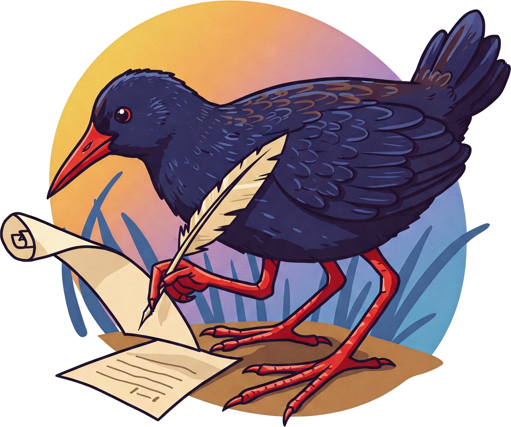

# LaTeX-Jam

A repository with different document templates in LaTeX.

This is designed to work on [GitHub codespaces](https://github.com/features/codespaces) to enable writing TeX files directly in the cloud without the need for a paid subscription, e.g., Overleaf.  See `.devcontainer` and `.vscode` for configurations.  With free add-ons like [Live Share](https://visualstudio.microsoft.com/services/live-share/) you can collaborate in real time.  Since this is a version controlled repo, all your changes can be tracked, forked, or rolled back as needed.

### Quickstart

1. Fork repo
2. Launch web editor (if online, press "." key)
3. Select "Create New Codespace..." 

### As a Subtree

This code is intentionally lightweight so it is highly portable. It is easy to add this repo as a subtree to another project then use it to write .tex documents inside of.

~~~bash
$ cd path/to/other/repo
$ git subtree add --prefix ./ https://github.com/mahynski/latex-jam.git main --squash
$ git commit -m "added latex-jam"
$ cd latex-jam; git remote rm origin # Disconnect local copy from parent as best practice
~~~

This is convenient for writing offline (not in a GitHub codespace).

### As a Fork

Alternatively, you can fork this repo and add the relevant images etc. for a specific project then begin editing in a codespace. This fork can be added as a aubtree to another project later, if desired. 

### Templates

You can start from scratch or find lots of useful templates on the internet. Here are a few suggestions to get started.  Download one and place it in the `docs/` directory to get started.

* [Overleaf LaTeX templates](https://www.overleaf.com/latex/templates)
* [LaTeX Templates: a part of creodocs](https://www.latextemplates.com/)

# Structure

* `docs/` - Contains .tex files you can edit. 
* `cls/` - Contains any specialized class (.cls) files for different .tex files.
* `img/` - Place images like headshots or signatures here.
* `pdf/` - PDF files will be saved here.

# Citation

The logo.png for this repository was generated using Google Gemini Flash 2.0 (Imagen 3) on Feb. 18, 2025 with the prompt "Create colorful logo of a the black rail bird (Laterallus jamaicensis) writing a document." Note that it has hallucinated a third appendage 😄! The black rail (*[Late]rallus [jam]aicensis*) was chosen as a logo based on the similarity of its scientific name to LaTeX.
